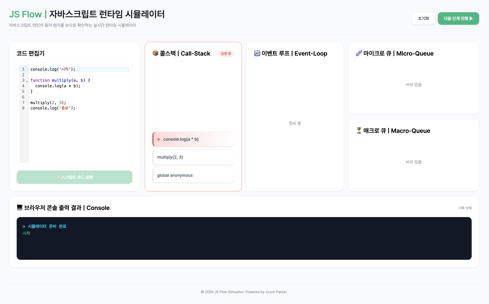

# JS Flow | 자바스크립트 런타임 시뮬레이터

> 자바스크립트 엔진과 브라우저 환경의 구동 원리(Call Stack, Web APIs, Microtask/Macrotask Queue, Event Loop)를 시각적으로 추적하고 단계별로 실행해 볼 수 있는 시뮬레이터 프로젝트입니다.<br/>

## 

<br/>

## 개발 목적 (Goal)

자바스크립트를 공부하며 늘 추상적으로나마 실행 흐름을 그려왔었습니다. 이에 동기, 비동기가 섞인 코드의 실행 순서가 헷갈린다거나, 변수 스코프를 고려하지 않고 함수를 작성하는 등의 실수를 종종 겪곤 했습니다. 따라서 좀 더 쉽게 이해하고 한 눈에 볼 수 있는 런타임 시뮬레이터는 없을까? 하는 마음에 구상하게 되었습니다.<br/>
본 프로젝트는 학습용이며 개발에 관심있고 자바스크립트 엔진에 대해 배우고자하는 분 모두에게 오픈될 예정입니다. 엔진 이해에 아주 조금의 도움이라도 되기를 바라겠습니다.

---

<br/>

## 핵심 기능 (Features)

- **코드 에디터(CodeEditor) 파싱 및 실행:** <br/>자바스크립트 코드를 AST로 파싱하여 실행 단위로 쪼개고, 런타임 실행을 준비합니다.

- **콜스택(Call-Stack) 실시간 시각화:** <br/>함수 호출 시 스택에 차례대로 쌓이고 실행이 끝나면 위에서부터 비워지는 콜스택(LIFO)의 전 과정을 중앙 저장소를 통해 실시간 동기화하여 보여줍니다.

- **터미널(Terminal) 출력:** <br/>콘솔 출력 메시지를 일반 로그, 경고, 에러, 시스템 메시지로 분류하여 출력합니다.

---

<br/>

## 개발 로드맵 (Roadmap)

> 보다 높은 완성도의 자바스크립트 비동기 런타임 환경을 제공하기 위해 아래 기능들이 **순차적으로 구현될 예정**입니다.

- [ ] **비동기 태스크 큐(Queue) 시각화:** <br/>마이크로태스크 큐와 매크로태스크 큐의 우선순위 처리 및 디큐(Dequeue) 흐름 시각화
- [ ] **이벤트 루프(Event Loop) 제어:** <br/>싱글 틱(Tick) 단위로 엔진의 현상태를 제어하고, 흐름에 맞게 스케쥴링하는 과정을 시각화
- [ ] **실행 컨텍스트(Execution Context) 시각화:** <br/>현재 실행 중인 코드의 범위(Scope)와 변수 객체 등을 담은 실행 컨텍스트의 생성 및 소멸 과정을 시각화

---

<br/>

## 기술 스택 (Tech Stack)

- **Framework**: React / Next.js
- **State Management**: Zustand (with Immer)
- **Code Editor**: @uiw/react-codemirror
- **AST Parser** : Acorn / Acorn-walk
- **Styling**: Tailwind CSS / Class Variance Authority (CVA) / Tailwind Merge
- **Animation**: Framer Motion

---

<br/>

## 프로젝트 구조 (Architecture)

```bash
src/
├── core/                # [Core] 순수 JS 엔진 비즈니스 로직
│
├── store/               # [ViewModel] 전역 상태 관리
|
├── hooks/               # [ViewModel] 전역 상태와 UI를 잇는 도메인 액션
│
├── components/          # [View] UI 레이어
│   ├── common/          # 공용 로우레벨 컴포넌트
│   └── dashboard/       # 대시보드 도메인 컴포넌트
│
├── styles/              # 스타일 관리
│   └── global.css       # 글로벌 스타일
|
├── storybook/           # UI 컴포넌트 격리 테스트 환경
|
├── utils/               # 타입 및 유틸리티 함수 관리
|   └── types/
│   └── lib.ts
|
├── App.tsx              # 메인 대시보드
└── main.tsx             # 엔트리 포인트
```

---

<br/>
<br/>

# 시작하기

> 배포는 **6월초 진행될 예정**이며 그 전까지는 로컬 서버를 통해 구동 부탁드립니다.

## 의존성 패키지 설치

```bash
npm install
# 또는
yarn install
# 또는
pnpm install
```

---

<br/>

## 로컬 개발 서버 구동

```bash
npm run dev
```
